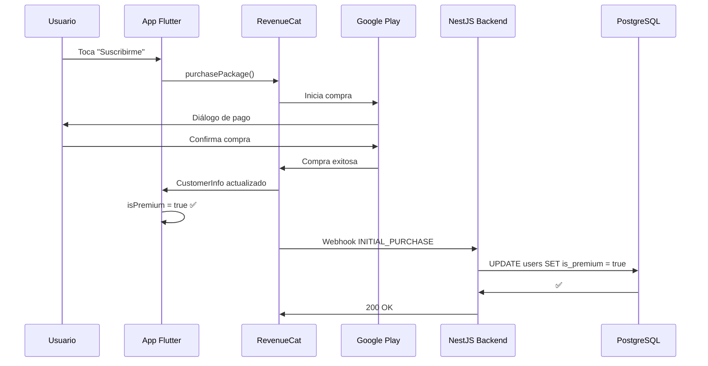

# 🎯 INTEGRACIÓN COMPLETA: RevenueCat + Flutter + NestJS

Guía paso a paso para implementar suscripciones premium en Struky usando RevenueCat.

---

## 📋 **ÍNDICE RÁPIDO**

1. [Configuración de Google Cloud](#1-configuración-de-google-cloud)
2. [Configuración de RevenueCat](#2-configuración-de-revenuecat)
3. [Backend - NestJS](#3-backend---nestjs)
4. [Frontend - Flutter](#4-frontend---flutter)
5. [Configurar Webhooks](#5-configurar-webhooks)
6. [Pruebas en Sandbox](#6-pruebas-en-sandbox)
7. [Deploy a Producción](#7-deploy-a-producción)

---

## 1️⃣ **CONFIGURACIÓN DE GOOGLE CLOUD**

Sigue la guía completa: [`GUIA_REVENUECAT_GOOGLE_CLOUD.md`](./GUIA_REVENUECAT_GOOGLE_CLOUD.md)

**Resumen:**
- ✅ Crear Service Account en Google Cloud
- ✅ Habilitar Google Play Android Developer API
- ✅ Configurar permisos en Google Play Console
- ✅ Descargar credenciales JSON
- ✅ Subir credenciales a RevenueCat

---

## 2️⃣ **CONFIGURACIÓN DE REVENUECAT**

### Paso 1: Crear proyecto en RevenueCat

1. Ve a: https://app.revenuecat.com/
2. Crea un nuevo proyecto: **"Struky Music App"**
3. Selecciona plataforma: **Android**

### Paso 2: Configurar Android

1. En **Project Settings** → **Google Play**:
   - Sube el archivo JSON de Service Account
   - Pega el **Google App-specific Shared Secret** (desde Play Console)

2. En **Apps**:
   - Package name: `com.struky.music` (o tu applicationId)
   - App name: `Struky`

### Paso 3: Crear Entitlements

1. Ve a **Entitlements**
2. Crea un nuevo entitlement:
   ```
   Identifier: premium
   Name: Premium Access
   Description: Full premium features without ads
   ```

### Paso 4: Crear Offerings

1. Ve a **Offerings**
2. Crea un nuevo offering:
   ```
   Identifier: premium_monthly
   Name: Premium Monthly
   Packages:
     - Monthly: product ID "premium_monthly" (de Google Play Console)
   ```

### Paso 5: Copiar API Key

1. Ve a **API Keys**
2. Copia la **Public API Key** de Android:
   ```
   goog_AbCdEfGhIjKlMnOpQrStUvWx
   ```
3. Guárdala, la necesitarás para Flutter

---

## 3️⃣ **BACKEND - NestJS**

### Paso 1: Ejecutar la migración de base de datos

```powershell
cd c:\appdefinitiva\apps\backend

# Ejecutar migración para agregar campos de RevenueCat
npm run typeorm:run
```

Esto agregará los siguientes campos a la tabla `users`:
- `revenuecat_user_id`
- `revenuecat_customer_id`
- `is_premium`
- `premium_expires_at`
- `last_revenuecat_sync`

### Paso 2: Configurar variables de entorno

Edita `apps/backend/.env` y agrega:

```env
# RevenueCat Configuration
REVENUECAT_WEBHOOK_SECRET=tu_webhook_secret_de_revenuecat
```

**Obtener el secret:**
1. Ve a RevenueCat Dashboard → **Webhooks**
2. Copia el **Authorization Header** value

### Paso 3: Verificar que el módulo esté cargado

El código ya está listo en:
- ✅ `src/modules/payments/revenuecat.service.ts`
- ✅ `src/modules/payments/revenuecat-webhook.controller.ts`
- ✅ `src/modules/payments/payments.module.ts` (actualizado)
- ✅ `src/common/entities/user.entity.ts` (con campos nuevos)
- ✅ `src/migrations/1736458800000-AddRevenueCatFieldsToUsers.ts`

### Paso 4: Reiniciar el backend

```powershell
# Si tienes el backend corriendo, reinícialo
npm run dev
```

Verifica en los logs que no haya errores:
```
[PaymentsModule] Módulo de pagos cargado
[RevenueCatService] RevenueCat service inicializado
```

---

## 4️⃣ **FRONTEND - FLUTTER**

### Paso 1: Instalar dependencias

```powershell
cd c:\appdefinitiva\apps\frontend

flutter pub get
```

Esto instalará `purchases_flutter: ^8.2.1` que ya está en `pubspec.yaml`.

### Paso 2: Configurar API Keys

**Opción A: Hardcodear (solo para desarrollo)**

Edita `lib/core/services/revenuecat_service.dart`:

```dart
static const String _androidApiKey = 'goog_TU_API_KEY_AQUI';
static const String _iosApiKey = 'appl_TU_API_KEY_AQUI'; // si tienes iOS
```

**Opción B: Variables de entorno (RECOMENDADO)**

1. Crea archivo `.env` en `apps/frontend/`:
   ```env
   REVENUECAT_ANDROID_KEY=goog_TU_API_KEY_AQUI
   REVENUECAT_IOS_KEY=appl_TU_API_KEY_AQUI
   ```

2. Agrega flutter_dotenv a pubspec.yaml:
   ```yaml
   dependencies:
     flutter_dotenv: ^5.1.0
   ```

3. Carga las variables en `main.dart`:
   ```dart
   import 'package:flutter_dotenv/flutter_dotenv.dart';
   
   Future<void> main() async {
     await dotenv.load(fileName: ".env");
     runApp(MyApp());
   }
   ```

### Paso 3: Inicializar RevenueCat después del login

En tu servicio de autenticación (`auth_service.dart`), después de un login exitoso:

```dart
import 'package:vintage_music_app/core/services/revenuecat_service.dart';

// Después del login
Future<void> _onLoginSuccess(String userId, String email) async {
  // Tu lógica existente...
  
  // Inicializar RevenueCat
  final revenueCat = RevenueCatService();
  await revenueCat.initialize(
    userId: userId,
    email: email,
  );
  
  // Verificar estado premium
  final isPremium = revenueCat.isPremium;
  print('🎯 Usuario es premium: $isPremium');
}
```

### Paso 4: Crear pantalla de suscripción

Crea `lib/features/subscription/screens/subscription_screen.dart`:

```dart
import 'package:flutter/material.dart';
import 'package:vintage_music_app/core/services/revenuecat_service.dart';
import 'package:purchases_flutter/purchases_flutter.dart';

class SubscriptionScreen extends StatefulWidget {
  const SubscriptionScreen({Key? key}) : super(key: key);

  @override
  State<SubscriptionScreen> createState() => _SubscriptionScreenState();
}

class _SubscriptionScreenState extends State<SubscriptionScreen> {
  final _revenueCat = RevenueCatService();
  List<Package> _packages = [];
  bool _isLoading = false;

  @override
  void initState() {
    super.initState();
    _loadPackages();
  }

  Future<void> _loadPackages() async {
    setState(() => _isLoading = true);
    
    final packages = await _revenueCat.getAvailablePackages();
    
    setState(() {
      _packages = packages;
      _isLoading = false;
    });
  }

  Future<void> _purchasePackage(Package package) async {
    setState(() => _isLoading = true);
    
    try {
      final success = await _revenueCat.purchasePackage(package);
      
      if (success) {
        // Mostrar mensaje de éxito
        ScaffoldMessenger.of(context).showSnackBar(
          const SnackBar(
            content: Text('🎉 ¡Ahora eres Premium!'),
            backgroundColor: Colors.green,
          ),
        );
        
        // Regresar a la pantalla anterior
        Navigator.pop(context);
      }
    } catch (e) {
      // Mostrar error
      ScaffoldMessenger.of(context).showSnackBar(
        SnackBar(
          content: Text('Error: ${e.toString()}'),
          backgroundColor: Colors.red,
        ),
      );
    } finally {
      setState(() => _isLoading = false);
    }
  }

  Future<void> _restorePurchases() async {
    setState(() => _isLoading = true);
    
    final success = await _revenueCat.restorePurchases();
    
    ScaffoldMessenger.of(context).showSnackBar(
      SnackBar(
        content: Text(
          success 
            ? '✅ Compras restauradas'
            : 'No se encontraron compras activas'
        ),
        backgroundColor: success ? Colors.green : Colors.orange,
      ),
    );
    
    setState(() => _isLoading = false);
  }

  @override
  Widget build(BuildContext context) {
    return Scaffold(
      appBar: AppBar(
        title: const Text('Hazte Premium'),
        actions: [
          TextButton(
            onPressed: _isLoading ? null : _restorePurchases,
            child: const Text('Restaurar'),
          ),
        ],
      ),
      body: _isLoading
          ? const Center(child: CircularProgressIndicator())
          : _packages.isEmpty
              ? const Center(child: Text('No hay planes disponibles'))
              : ListView.builder(
                  padding: const EdgeInsets.all(16),
                  itemCount: _packages.length,
                  itemBuilder: (context, index) {
                    final package = _packages[index];
                    final product = package.storeProduct;

                    return Card(
                      margin: const EdgeInsets.only(bottom: 16),
                      child: ListTile(
                        title: Text(product.title),
                        subtitle: Text(product.description),
                        trailing: Column(
                          mainAxisAlignment: MainAxisAlignment.center,
                          crossAxisAlignment: CrossAxisAlignment.end,
                          children: [
                            Text(
                              product.priceString,
                              style: const TextStyle(
                                fontSize: 18,
                                fontWeight: FontWeight.bold,
                              ),
                            ),
                            Text(
                              '/${product.subscriptionPeriod}',
                              style: const TextStyle(fontSize: 12),
                            ),
                          ],
                        ),
                        onTap: () => _purchasePackage(package),
                      ),
                    );
                  },
                ),
    );
  }
}
```

### Paso 5: Escuchar cambios de estado premium

En tu widget principal o donde gestiones el estado global:

```dart
import 'package:vintage_music_app/core/services/revenuecat_service.dart';

class _MyAppState extends State<MyApp> {
  final _revenueCat = RevenueCatService();
  
  @override
  void initState() {
    super.initState();
    
    // Escuchar cambios de estado premium
    _revenueCat.premiumStatusStream.listen((isPremium) {
      print('🎯 Estado premium cambió: $isPremium');
      
      // Actualizar UI, remover anuncios, etc.
      setState(() {
        // Tu lógica
      });
    });
  }
  
  @override
  Widget build(BuildContext context) {
    // Tu widget
  }
}
```

---

## 5️⃣ **CONFIGURAR WEBHOOKS**

### Paso 1: Exponer tu backend públicamente

**En desarrollo (con ngrok):**

```powershell
# Instala ngrok: https://ngrok.com/download

# Ejecuta tu backend localmente
npm run dev

# En otra terminal, expone el puerto 3000
ngrok http 3000
```

Obtendrás una URL pública:
```
https://abc123.ngrok.io
```

**En producción:**

Si ya tienes tu backend desplegado (Railway, Heroku, AWS, etc.):
```
https://api-struky.railway.app
```

### Paso 2: Configurar webhook en RevenueCat

1. Ve a RevenueCat Dashboard → **Webhooks**
2. Haz clic en **"+ New"**
3. Configura:
   ```
   URL: https://tu-backend.com/api/webhooks/revenuecat
   Authorization: (copia el header que te dan)
   ```
4. Selecciona los eventos:
   - ✅ Initial Purchase
   - ✅ Renewal
   - ✅ Cancellation
   - ✅ Expiration
   - ✅ Billing Issue
   - ✅ Product Change

5. Haz clic en **"Add Webhook"**

### Paso 3: Probar el webhook

RevenueCat tiene un **Send Test** button:

1. En la configuración del webhook, haz clic en **"Send Test"**
2. Selecciona evento: **"INITIAL_PURCHASE"**
3. Verifica en tus logs de NestJS:
   ```
   [RevenueCatWebhookController] 📥 Webhook recibido de RevenueCat
   [RevenueCatWebhookController] 🎯 Tipo: TEST_EVENT
   ```

---

## 6️⃣ **PRUEBAS EN SANDBOX**

Sigue la guía completa: [`GUIA_PRUEBAS_SANDBOX_REVENUECAT.md`](./GUIA_PRUEBAS_SANDBOX_REVENUECAT.md)

**Checklist rápido:**
- [ ] Crear producto en Google Play Console
- [ ] Agregar cuenta de tester
- [ ] Generar APK de release y subirlo a Internal Testing
- [ ] Descargar app desde Play Store en dispositivo de prueba
- [ ] Realizar compra y verificar "This is a test purchase"
- [ ] Verificar que `isPremium` se actualiza en la app
- [ ] Verificar que el webhook llega al backend
- [ ] Verificar que PostgreSQL se actualiza

---

## 7️⃣ **DEPLOY A PRODUCCIÓN**

### Backend

1. Asegúrate de que `REVENUECAT_WEBHOOK_SECRET` esté en las variables de entorno de producción

2. Verifica que la URL del webhook en RevenueCat apunte a tu backend de producción:
   ```
   https://api-struky.com/api/webhooks/revenuecat
   ```

### Frontend

1. **Actualiza las API Keys** en el código o en variables de entorno

2. **Genera el App Bundle para producción**:
   ```powershell
   flutter build appbundle --release
   ```

3. **Sube a Google Play Console** → **Production**

4. **Publica la app**

### Configuración final

1. **Remueve cuentas de tester** (opcional)
2. **Activa productos** en Google Play Console
3. **Verifica webhooks** con compras reales

---

## 🎯 **FLUJO COMPLETO END-TO-END**



---

## 📊 **VERIFICACIÓN FINAL**

### Checklist de producción:

**Google Cloud:**
- [ ] Service Account creada
- [ ] API habilitada
- [ ] Permisos configurados en Play Console

**RevenueCat:**
- [ ] Proyecto creado
- [ ] Credenciales subidas
- [ ] Entitlements configurados
- [ ] Offerings configurados
- [ ] API Keys copiadas
- [ ] Webhooks configurados

**Backend:**
- [ ] Migración ejecutada
- [ ] Variables de entorno configuradas
- [ ] Webhook endpoint funcionando
- [ ] Logs verificados

**Frontend:**
- [ ] purchases_flutter instalado
- [ ] RevenueCatService implementado
- [ ] API Keys configuradas
- [ ] Pantalla de suscripción creada
- [ ] Listeners configurados

**Testing:**
- [ ] Compras en Sandbox funcionan
- [ ] Webhook llega correctamente
- [ ] Base de datos se actualiza
- [ ] Restauración funciona
- [ ] Cancelación funciona

---

## 🚀 **SIGUIENTES PASOS**

Una vez que todo esté funcionando:

1. **Analytics**: Integra eventos de compra en Firebase Analytics
2. **Push Notifications**: Notifica a usuarios cuando su suscripción está por expirar
3. **Email Marketing**: Envía emails de bienvenida a nuevos premium
4. **A/B Testing**: Prueba diferentes precios y offerings
5. **Promociones**: Crea ofertas especiales con RevenueCat

---

## 📞 **SOPORTE**

Si tienes problemas:

1. **Logs de Flutter**: Habilita `LogLevel.debug` en RevenueCat
2. **Logs de Backend**: Revisa los logs del webhook controller
3. **Dashboard de RevenueCat**: Verifica transacciones y customer info
4. **Google Play Console**: Verifica órdenes y suscripciones

---

✅ **¡Integración completa lista para producción!** 🎉
